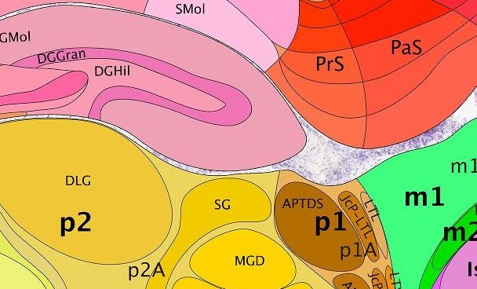

Table of Contents
=================

-   [allenBrain](#allenbrain)
    -   [Example usage](#example-usage)
-   [Recent non-reverse compatible changes](#recent-non-reverse-compatible-changes)

allenBrain
==========

This R package acquires pictures from Allen Brain Atlas. Cropping and centering images requires magick that is listed in `Suggests` so it won't be automatically installed. Get it by:

``` r
install.packages("magick")
```

Install allenBrain to R

``` r
devtools::github_install('oganm/allenBrain')
```

Example usage
-------------

``` r
# get a list of structure names and ids
IDs = getStructureIDs()
IDs %>% head
```

    ##    id                          name  acronyms parent
    ## 1 997                          root      root   <NA>
    ## 2   8 Basic cell groups and regions      grey    997
    ## 3 567                      Cerebrum        CH      8
    ## 4 688               Cerebral cortex       CTX    567
    ## 5 695                Cortical plate     CTXpl    688
    ## 6 315                     Isocortex Isocortex    695

``` r
# get the id of the desired region
granuleID = IDs['Dentate gyrus, granule cell layer' == IDs$name,]$id

# get the dataset for the desired gene (the first saggital experiment that did not fail)
datasetID = getGeneDatasets(gene = 'Prox1',
                            planeOfSection = 'sagittal',
                            probeOrientation = 'antisense')[1]


# get the slide that has the desired brain region and coordinates of the center of the region
imageID = structureToImage(datasetID = datasetID, regionIDs = granuleID)

# get the closest atlas image. 
atlasID = imageToAtlas(imageID$section.image.id,imageID$x,imageID$y,planeOfSection ='sagittal')

# download the slide
downloadImage(imageID = imageID$section.image.id, 
             view = 'projection',
             outputFile = 'README_files/image.jpg',
             downsample = 2)
```


``` r
# download the atlas
downloadAtlas(imageID = atlasID$section.image.id, 
             outputFile = 'README_files/atlas.jpg',
             downsample = 2)
```


If `magick` is installed you can output a `magick-image` object by setting `outputFile = NULL`

If `magick` is installed images can be centered by providing center coordinates of a brain region. Input is either a file path or a `magick-image` object

``` r
# crop the slide so that the desired brain region is in the center
centerImage(image = 'README_files/image.jpg', 
            x = imageID$x,
            y= imageID$y,
            xProportions = c(.1,.1),
            yProportions =c(.1,.1),
            outputFile = 'README_files/cropped.jpg',
            downsample = 2)
```


``` r
centerImage(image = 'README_files/atlas.jpg', 
            x = atlasID['x'],
            y= atlasID['y'],
            xProportions = c(.1,.1),
            yProportions =c(.1,.1),
            outputFile = 'README_files/croppedAtlas.jpg',
            downsample = 2)
```



Grid data of a dataset can be downloaded by `gridData` function

``` r
gridData(datasetID = datasetID,
         outputFile ='README_files/Prox1_data.zip',
         include = c('energy','density','intensity'))
unzip(zipfile = 'README_files/Prox1_data.zip',exdir = "README_files/")
```

Recent non-reverse compatible changes
=====================================

-   Output of `getStructureIDs` now returns acronyms and parents. `name` column no longer is in full lowercase
-   Mispronounced `dowloadImage` fixed and is now `downloadImage`
-   `getImageID` changed to `imageToAtlas`. Now accepts multiple region IDs and returns a data frame. Keeps original field names from the API output
